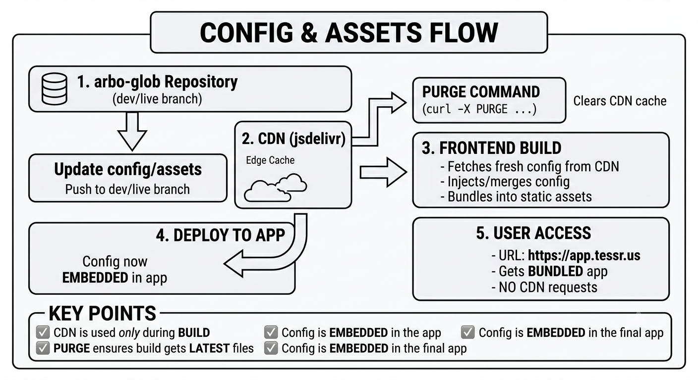

# 🌿 arbo-glob

This repository contains **variables**, **configuration**, and **global style settings** that can be used across applications.

---

## 📁 Project Structure

```
arbo-glob/
├── .env.json             # Configuration file
├── dist/                 # Compiled output files
│   └── tessr.css         # Compiled global styles (ready to use)
├── src/
│   ├── style/
│   │   └── changelog/    # Version history and updates
│   │       └── README.md # Changelog documentation
│   └── util/             # Style conversion utilities
│       └── README.md     # Converter usage guide
└── README.md             # This file
```

---

## 🚀 How to Use

### ⚙️ Configuration
- Navigate to `.env.json`
- Update the configuration values based on your project needs

---

### 🎨 Global Styles
- Go to `dist/tessr.css`
- Use this compiled file directly in your application
- https://cdn.jsdelivr.net/gh/arbocollab/arbo-glob@dev/dist/tessr.css
- https://cdn.jsdelivr.net/gh/arbocollab/arbo-glob@dev/dist/tessr.styl

---

### 📝 Changelog
- Navigate to `src/style/changelog/`
- Refer to the `README.md` inside for updates and version history of global styles

---

### 🔄 Style Converter
- Navigate to `src/util/`
- Use the provided converter scripts to transform styles into different formats:
  - `.css`
  - `.styl` (Stylus)
  - and more (depending on usage)

- Refer to the `README.md` inside for detailed usage instructions

---

### 🎨 i18n Translation file
- Go to `src/i18n/en-error.json`
- Update the message inside based on the i18n structure
- The version folder is used for backward compatibility, example `src/i18n/1.0.0/en-error.json`

---

### 📝 Changelog
- Navigate to `src/i18n/changelog/`
- Refer to the `README.md` inside for updates and version history of translation files

---

## ⚠️ Notes

- Always update configuration via `.env.json`
- Use compiled files styles from `dist/` for production
- Check changelog regularly for updates and breaking changes

## Architecture
